# Fairness - LLMs: Toxicy and Bias

The following report discusses prevalent toxicy and bias issues that exist within Large Language Models (LLMs). We discuss the following four works that were given to us, and critically analyze key aspects. This includes:

- [On the Dangers of Stochastic Parrots: Can Language Models Be Too Big?](https://dl.acm.org/doi/pdf/10.1145/3442188.3445922)
- [REALTOXICITYPROMPTS: Evaluating Neural Toxic Degeneration in Language Models](https://arxiv.org/pdf/2009.11462)
- [OPT: Pre-trained Transformer Language Models](https://arxiv.org/pdf/2205.01068)
- [StereoSet:Measuring stereotypical bias in pre-trained language models](https://aclanthology.org/2021.acl-long.416.pdf)

## [On the Dangers of Stochastic Parrots: Can Language Models Be Too Big?](https://dl.acm.org/doi/pdf/10.1145/3442188.3445922)

### Introduction and Motivations:

The large-scale development of Large Language Models (LLMs) has transformed the Natural Language Processing (NLP) field.
With the help of further architectural developments, LLMs such as BERT and GPT have become increasingly accurate in basic 
tasks such as question answering, content generation, and summarization of texts. In fact, LLMs have become so successful
at a mainstream level that many corporations around the world are investing heavily in these technologies.
However, relatively little research has been conducted to understand the risks and harms associated with the rise of LLMs.
Although LLMs provide an invaluable service to organizations around the world, the associated risks in using these 
technologies as well as the mitigation strategies are often overlooked. This paper primarily focuses on analyzing the
social effects of LLMs, specifically how LLMs can have irreparable environmental costs and how LLMs can often 
over-represent certain political views while suppressing others. 

### Methods:

There are no formal methods explicitly discussed in this paper. However, the paper makes numerous references to n-gram language models, word embeddings, and Transformer-based models. A language model can be defined as a model that can predict the likelihood of next token given its preceding context or its surrounding context. In order to represent linguistic words as machine-understandable content, word embeddings are used. This can be thought of as a representation of a single word in a numerical representation (i.e. Vectors)​. Common word embeddings include Word2Vec, GloVe, Context2Vec, and ELMo. Below is a figure that shows how Word2Vec and GloVe word embeddings are represented in a vector space:

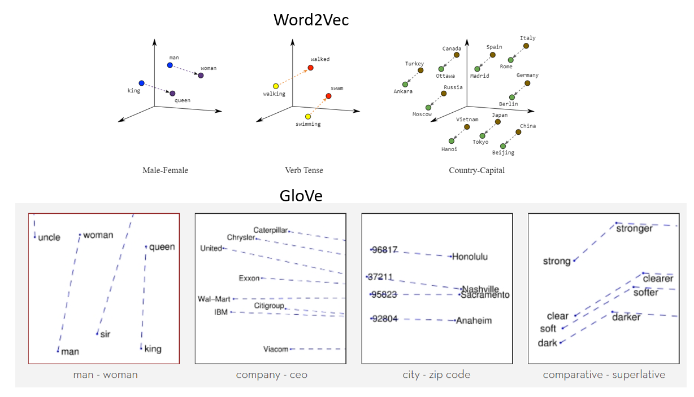

### Key Findings:

The Key Findings section will be broken down into three main sections:
- Environmental and Financial Effects
- Social Impacts
- Stochastic Parrots

#### Environmental and Financial Impacts:

While the upscaling of LLMs introduces a more robust, accurate tool, it usually does not come without incurring additional costs.
While the average human is responsible for five tons of CO2 emissions per year, training a Transformer model can emit nearly 284 
tons of CO2. Furthermore, in some cases training certain Machine Learning models can require as much energy as a flight across the
United States. Training these Machine Learning models often require the use of non-renewable resources, although it should also be
noted that some of this energy is also supplied through expensive, renewable resources as well. Practicality plays a key role in
truly understanding the environmental effects of training Machine Learning models, particularly when a tradeoff decision between
performance and energy utilized need to be made. 

A BiLingual Evaluation Understudy (BLEU) score indicates how effective a machine translation is when compared to a human annotation,
given a sentence. In one study that assessed the cost of models versus accuracy gains, an increase in 0.1 in BLEU score points for
English to German translation resulted in an increase of $150,000 compute cost and additional carbon emissions. While the tradeoff
for performance appears to be relatively negligible in this case, there might also be cases where performance is important and
supersedes any additional costs incurred during training. It is also important to note that the concept of efficiency in Machine
Learning was never really taken seriously until 2019, when efficiency was first introduced as a benchmark metric.

The use of LLMs also indirectly introduces the notion of environmental racism. The paper defines environmental racism as the
“negative effects of climate change (that) reach and impact the world’s most marginalized communities.” Many communities within first-world
countries have proper access to the internet and can access LLMs. However, there are many other countries that often question the value of LLMs
versus the environmental risks that are, in some cases, imminent. Given that the Maldives is expected to be underwater by the year 2100 and 
nearly 800,000 people are affected by floods in Sudan, is it fair that the benefits of LLMs that the privileged reap come at a cost to those 
that are underprivileged? This becomes particularly important to consider, especially given large-scale models for underutilized languages are 
often afterthoughts, and not taken seriously in reality. This is a key point for debate!

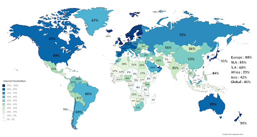

Figure #2: Percent of citizens that have access to the internet in each country across the world.

To address these ongoing environmental issues within Machine Learning, the paper introduces a concept referred to as Green AI. Green AI is an informal initiative to encourage Machine Learning practitioners into utilizing environmentally friendly options while training Machine Learning models. This includes promoting efficiency as an evaluation benchmark, as highlighted in the paragraph above. Furthermore, initiatives such as SustainNLP have been designed to prioritize the goal of producing “computationally efficient hardware and algorithms.” Additional recommendations include utilizing carbon-friendly regions for running experiments, and regular reporting of carbon/energy metrics.

#### Social Impacts:

In order to train an LLM, large amounts of data are required! The internet has plentiful data that can be utilized for training purposes, and has been the backbone for many cutting-edge LLMs. However, the curation methods of internet-based datasets need to be properly assessed. Many studies have given indications that large, uncurated, internet-based datasets encode negative views with regards to gender, race, ethnicity and disability status. When such data is not properly curated, this results in models that are often biased themselves. The Common Crawl is a large dataset that contains petabytes of data that have been collected as a result of years of data collection via the internet. GPT-3, a common LLM, has utilized a filtered version of the Common Crawl. One would expect that the dataset used to train a mainstream LLM to be representative of world views, but instead further research indicates that viewpoints that are hegemonic, supremacist, and misogynistic in nature were more likely to be retained within this filtered dataset.

GPT-3 was developed by using a filtered version of the Common Crawl dataset, one that was similar to the dataset used to develop GPT-2. Although this concept appears harmless in theory, many documents found in the training data were linked to predominantly male-visited websites such as Reddit and Wikipedia. Although additional filters were included to remove pages associated with hate speech, sexism, and other negative forms of speech, this also comes with potentially suppressing training data obtained from online spaces created and maintained by the LGBTQ+ community. Furthermore, investigations of the GPT-2 training data found nearly 272,000 documents from untrustworthy news sites and nearly 63,000 documents from banned subreddits. This brings the question of whether the data used to train these LLMs are truly trustworthy? Or is it worth revisiting its reliability?

As shown in Figure #2, the proportion of citizens that have access to the internet in their respective countries varies significantly. While a major proportion of citizens have access to the internet in developed countries (i.e. United States, Canada, European Union, etc.), a significant proportion of citizens in underdeveloped nations in Africa and Asia do not have such access. This paints a clearer idea of the perspectives that are outlined in web-scrapped training data. Furthermore, not only does the internet data tend to overrepresent younger citizens, but can also include data from sources that have historically been unwelcoming to minority groups. These examples clearly indicate that internet access distribution is clearly uneven, and yet is considered a good representation of model training data at the same time.

In efforts to accommodate for changing social views over time, the paper proposes a form of regularly updating data to make sure that new changes in social norms and language are reflected in the training data. The paper refers to this phenomenon as a “reframing” technique, and highlights that fine-tuning an LLM could potentially be efficient as well. Furthermore, model auditing could be a key avenue in potentially filtering harmful data from surfacing in these training models. However, in many cases model auditing also presents its own biases. There have been instances where models have been found to associate higher toxicity levels with marginalized groups. 

#### Stochastic Parrots:

The concept of Natural Language Understanding (NLU) emphasizes the ideal that LLMs cannot "process" (or think through) the words that are produced by a probabilistic model. Although a sentence produced by an LLM may sound coherent, that does not always mean it will be correct and necessarily "sound" in context. That said, the term stochastic parrot is defined in the paper as "stitching together sequences of linguistic forms it has observed in its vast training data, according to probabilistic information about how they combine, but without any reference to meaning." Given the information provided in the Social Impacts section, the training data of an LLM is likely to be biased with opinions and viewpoints of those who are at a higher level of socioeconomic status. This introduces the possibility of further propagation of stereotypes and microagressions against people of certain age, gender and ethnicity, particularly if an LLM were to output abusive and harmful language as a result of such training data.

There is also cause for concern for using these "stochastic parrots" for malicious intents as well. The paper highlights instances of how LLMs such as GPT-3 could potentially be utilized to generate text in the form of a conspiracy theorist and propagate misinformation to extremist groups and their respective message boards. As discussed previously in our lectures of Differential Privacy, there is also the slight possibility of utilizing LLMs to extract personal identifiable information (PII) that are present in the training data.

#### Critical Analysis:

The paper does an excellent job of outlining the potential of skewed variables that are involved underneath the algorithms of LLMs, as well as the long-term implications of using LLMs without proper regulation or in-depth research to adjacent topics. Although this paper served mostly as informative, the paper focused on environmental, financial and training data concerns - concepts that are not typically discussed in a traditional Machine Learning paper. The paper supported each of its claims by referencing past papers that have thoroughly documented the claims made in this paper. 

One of the strengths of this paper was the breadth of the topics covered, and effectively connecting them together. By clearly outlining the implications of LLMs in three different areas, the authors do a great job in conveying the plethora of consequences behind extensive use of LLMs without proper guardrails. Furthermore, the paper presented its argument in a cohesive and structured format, and introduced a “domino effect” of how one tool can have a multitude of effects on the environment and human psyche. However, the paper could have done a better job in eliciting opinions from the general public. 

Although this paper was primarily designed to be an informative paper outlining the potential dangers of LLMs, it would have been beneficial to have included user studies from populations that use LLMs on a daily basis. For example, have LLM users encountered the biases that the paper addresses? Including a user study that asks such questions would further substantiate the paper’s claims. Apart from this, the paper keeps an objective perspective in explaining the dangers of LLMs, and acknowledges proper ethical considerations as well.

## [REALTOXICITYPROMPTS: Evaluating Neural Toxic Degeneration in Language Models](https://arxiv.org/pdf/2009.11462)

### Introduction and Motivations:

Pretrained neural language models (LMs), such as GPT-2 and GPT-3, have natural language generation (NLG) with their high fluency and coherence. However, despite their impressive capabilities, these models frequently exhibit toxic degeneration—the tendency to generate racist, sexist, or otherwise harmful language, even when given seemingly innocuous prompts. This issue raises serious ethical concerns and presents obstacles to the safe deployment of AI in real-world applications such as chatbots, content moderation, and text generation tools. The toxicity problem is rooted in the training data, which is often sourced from unfiltered web text, including Reddit discussions, news articles, and online forums. Since language models learn statistical patterns from their training corpora, they inevitably inherent biases, offensive speech, and misinformation. The authors introduce REALTOXICITYPROMPTS, a dataset of 100,000 naturally occurring prompts, extracted from a large English web text corpus, with each prompt labeled using the PERSPECTIVE API for toxicity scores. This dataset is designed as a benchmark to evaluate the extent to which LMs generate toxic content. The paper has three primary objectives: (1) to assess how frequently LMs produce toxic output, (2) to evaluate detoxification strategies that attempt to mitigate toxicity, and (3) to investigate the role of training data in shaping toxic behavior in LMs. The findings suggest that even non-toxic prompts can result in toxic generations, and that filtering training data alone is insufficient to prevent toxic outputs.

### Methods:

The paper test with unprompted and prompted generation to see toxicity

#### Understanding the Datasets: REALTOXICITYPROMPTS, WebText, and OWTC

The study evaluates five major autoregressive transformer-based LMs:

1. GPT-1 ( trained on book corpora)
2. GPT-2 ( trained on OpenAI WebText)
3. GPT-3 ( trained on Common Crawl, Wikipedia, books)
4. CTRL ( trained on domain-specific control tokens)
5. CTRL-WIKI ( a version trained solely on Wikipedia)

The authors focus on analyzing training data, particularly WebText, which is a primary source for GPT-2’s training.

- WebText (OPENAI-WT):
    - Created by OpenAI and used to train GPT-2.
    - Contains internet text scraped from outbound Reddit links.
    - Some explicitly harmful subreddits were filtered, but much of the data remains unfiltered.
- OpenWebText Corpus (OWTC):
    - A publicly available replica of WebText.
    - Based on the same Reddit-linked web text but lacks OpenAI’s proprietary filtering.
    - Used as a substitute for WebText in this study.
- REALTOXICITYPROMPTS:
    - Extracted from OWTC (Reddit-based web text).
    - 100,000 prompts were selected and labeled using PERSPECTIVE API to score their toxicity.
    - Used as a benchmark to evaluate how often LMs generate toxic content.

How to measure toxicity in Neural models:
1. The expected maximum toxicity over k= 25 generations, which we estimate with a mean and standard deviation
2. The empirical probability of generating a spanwith TOXICITY ≥0.5 at least once over k = 25 generations

How to measure toxicity scores:
- Google’s PERSPECTIVE API is used to measure toxicity in both prompts and model-generated text.
- It assigns a toxicity score between 0 and 1 and If the toxicity score is ≥0.5, the text is considered toxic

Detoxification Methods:
1. Data-Based Detoxification (Modifying Pretraining Data)
    - Domain-Adaptive Pretraining (DAPT): Retrains GPT-2 on a filtered dataset with non-toxic text.
    - Attribute Conditioning (ATCON): Adds special tokens (<|nontoxic|> and <|toxic|>) before each prompt to steer model behavior.
2. Decoding-Based Detoxification (Adjusting the Generation Process)
    - Vocabulary Shifting (VOCAB-SHIFT): Reduces the probability of toxic words during generation.
    - Word Filtering:Explicitly bans slurs, profanity, and toxic words from appearing in generated text.
    - Plug-and-Play Language Models (PPLM): Dynamically adjusts the hidden representations of GPT-2 to steer generation away from toxicity.

### Key Findings:

The paper’s three most important findings are:

1. Even without any prompts (unprompted generation), language models still generate toxic text, proving that toxicity originates from pretraining data.
2. Even non-toxic prompts can trigger toxic responses, meaning models can introduce toxicity into otherwise safe contexts.
3. Detoxification techniques help, but no method completely prevents toxicity.

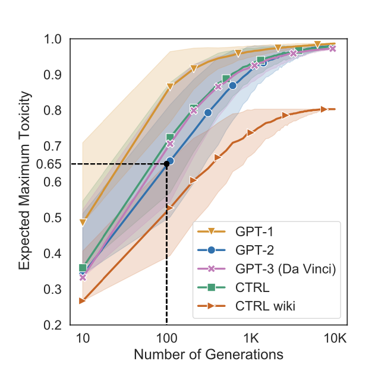 

This figure shows that even if we don’t give any prompts, language models still can generate toxic content, which proves that toxicity is coming and learning from pretraining data. And we can see that GPT-2 and GPT-1 exhibit maximum toxicity with 100 generations while CTRL- wiki is the least, which proves that pretraining on cleaner data can reduce harmful outputs, meaning that filtering training corpora is crucial for training these language models.

 

This table shows that even if we input innocuous and harmless words, language models still can generate non-trivial toxic rates, which is nearly or above 50%. This means that language models carrying toxicity from pretraining data and can actively introduce toxicity. Therefore, we need to consider how these unpredictable AI-generated contents may pose concern in real-world applications.

Detoxification strategies truly help to reduce toxicity, but none of the methods can completely eliminate it. Also, while some methods work better than others, it still can generate toxic content. As we can see, DAPT(Domain-adaptive pretraining on Non-toxic data) is the most effective in data-based, but still allows some toxicity. PPLM(Plug-and-Play language model) is the most effective in these methods, but it’s computationally expensive. Word Filtering is the least effective, since it can still generate toxic contents, which we find filtering or banning bad words is less successful than pretraining non-toxic data. 

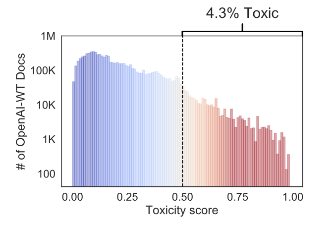
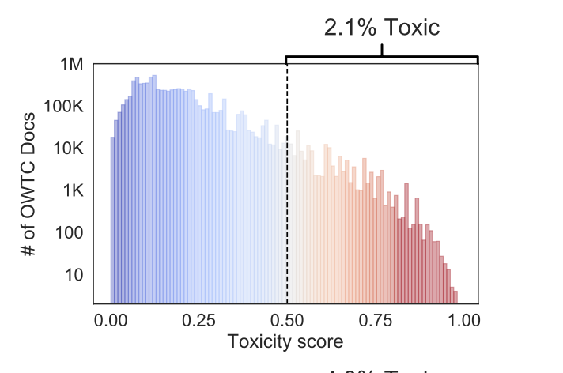

4.3 % of OpenAI-WT(GTP-2’s pretraining data) is highly toxic compared to 2.1% of OWTC. It indicates that the level of toxic output directly correlates with the toxicity in the pretraining dataset. 

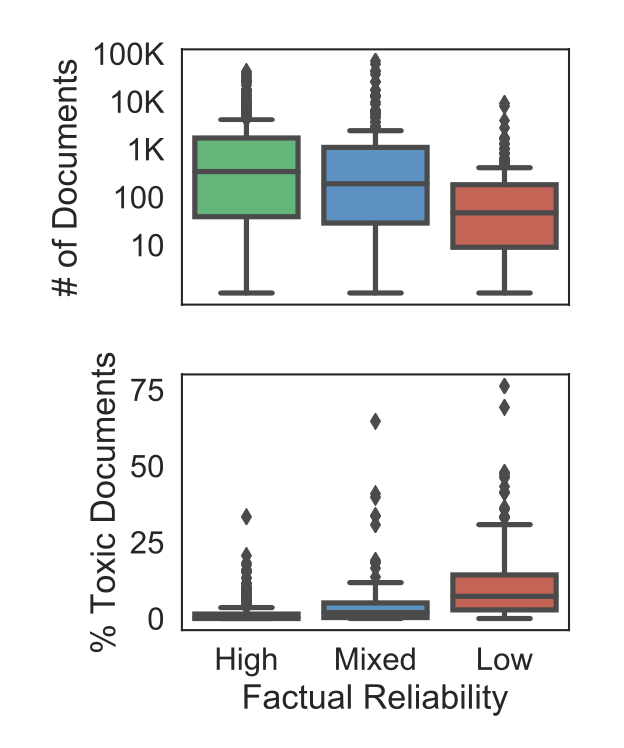

The top shows Factual reliability in news sites that make up OWTC, the bottom shows that the unreliable news sources in OWTC have a much higher proportion of toxic content than high reliability ones. Thus, training on low reliability, misinformation sources increase toxic output. The best way to prevent toxicity is not through filtering outputs but by curating cleaner training datasets. Models trained on cleaner data (like Wikipedia) generate significantly less toxicity.

### Critical Analysis:

The paper examines toxic language generation in AI models, showing that toxicity comes from pretraining data, not just user input. Using REALTOXICITYPROMPTS, a 100,000-prompt dataset, it tests five major models (GPT-1, GPT-2, GPT-3, CTRL, CTRL-WIKI) and finds that all can produce toxic content, even without prompts. The study also compares different detox methods, finding that DAPT (pretraining on non-toxic data) works best, while banning bad words is ineffective. Figures 3 and 4 prove that models trained on toxic data generate more harmful content, stressing the need for better dataset selection. The paper also highlights ethical concerns about AI-generated toxicity and the challenge of balancing safety with free speech.

However, there are some issues. The study relies on PERSPECTIVE API, which mislabels some non-toxic text as toxic, especially in African American English (AAE). It only tests GPT-style models and does not include BERT or other AI types, making it less applicable to different AI tasks. Some detox methods, like PPLM and DAPT, are slow and expensive, limiting their real-world use. The paper also does not explore whether detoxifying AI could accidentally remove important discussions on race, gender, or politics, raising concerns about censorship.

The study also reveals biases in training data, as it mostly comes from Reddit, which skews content toward Western, male-dominated perspectives. This raises questions about fairness—whose voices are being learned by AI, and whose are being ignored? Since Reddit-linked data may not represent broader language use, future AI models should be trained on more diverse sources to reduce bias.

From an ethical standpoint, the paper warns that toxic AI can spread harmful stereotypes, misinformation, and offensive content if not properly controlled. However, too much filtering could lead to excessive censorship, making it hard for AI to talk about sensitive but important topics. While the authors call for more transparency in AI training, they do not suggest clear steps for balancing AI safety with free speech. Future research should focus on better detox methods that remove harm without limiting important conversations.

## [OPT: Pre-trained Transformer Language Models](https://arxiv.org/pdf/2205.01068)

### Introduction and Motivations:

The currently limited access to Large Language Models has posed a significant challenge in research to improve robustness, bias, and toxicity. They argue that definitions of risk, harm, bias, and toxicity, among other challenges, should be researched by a larger community, which isn’t possible with limited access to LLMs. LLMs are very powerful tools but are also expensive to train, additionally, the public can only access them through paid APIs. For example, OpenAI’s GPT-3 model has around 175B parameters and has demonstrated zero-shot and few-shot learning capabilities. However, the models are proprietary. The authors of this paper introduce a new suite of models, OPT (Open Pre-trained Transformers), which they aim to fully share with researchers to further their work. The authors' objective with the OPT models is to match, both the size and performance of GPT-3. The size of the OPT models range from 125M to 175B with OPT-175B being comparable to GPT-3’s performance. In summary, the objectives of OPT models are to provide an open-source alternative to GPT-3 with full access to model weights, train models more efficiently, reduce carbon footprint to 1/7th of GPT-3, and improve transparency.

### Methods:

The OPT models are decoder-only transformer models, similar to GPT-3, and the table below describes their architecture, with a report on the number of layers, the number of attention heads, the embedding size, the peak learning rate, and the global batch size in the number of tokens. 

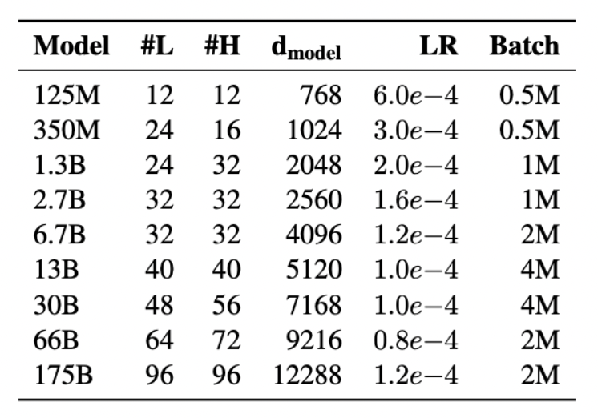

The table above presents results on eight Transformer language modes with sizes ranging from 125M to 175B. Their training was optimized for scalability and efficiency. Training followed Megatron-LM initialization, using a normal distribution with zero mean and a standard deviation of 0.006. The bias terms were initialized to zero. For the optimizer, the researchers used AdamW with β1 = 0.9, β2 = 0.95, and weight decay of 0.1. Learning rate decay was set at 10% of the max learning rate over 300B tokens. The gradient clipping was initially set at 1.0, then later reduced to 0.3 to stabilize the training. The batch sizes ranged from 0.5 to 4M tokens, depending on model size. These models were trained on 992 NVIDIA A100 GPUs and achieved 147 TFLOP/s per GPU. The researchers used ~180B total tokens from diverse datasets with RoBERTa, The Pile, and PUshShift.io Reddit as sources. When processing the data, MinhashLSH filtering was used to remove duplicates. For training efficiency, Fully Sharded Data Parallelism (FSDP) with Megatron-LM Tensor Parallelism was used in addition to mixed precision training, and dynamic loss scaling. The researchers did encounter some challenges during training including hardware failures, loss divergence, and some mid-flight adjustments that were necessary such as updating to a newer Megatron version to improve throughput. 

#### Evaluations:

The authors evaluated the OPT models on 16 standard NLP tasks utilized in previous literature. The results are compared primarily with GPT-3 but include other LLMs as well. The figure below shows the Zero-shot NLP evaluation averages. It shows that OPT largely matches the reported averages of GPT-3 but performance varies by task

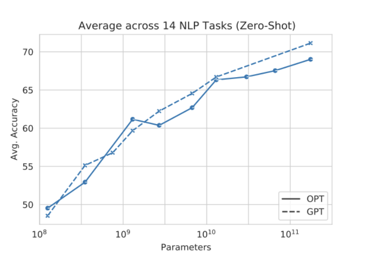

The figure below represents the Multi-shot performance and shows that GPT-3 does outperform OPT for one-shot and few-shot. The performance depends heavily on task. The performance difference was seen especially on MiltiRC and ARC Challenge.

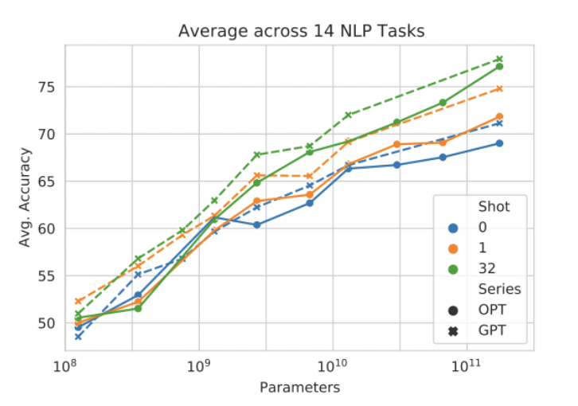

Additionally, the researchers evaluated OPT’s dialogue capabilities. The performance was evaluated on ConvAI2, Wizard of Wikipedia, Empathetic Dialogues, and BlendedSkillTalk, among others. As seen in the table below, OPT outperformed the Reddit 2.7B model, matched Supervised BelnderBot-1 in some cases, and had a strong ability to maintain persona consistency. 

#### Bias and Toxicity Evaluations:

Bias and Toxicity were evaluated in 5 categories:
- Hate Speech Detection
- Stereotype Bias Evaluation (CrowS-Pairs)
- Stereotypical Associations (StereoSet)
- Toxic Content Generation
- Dialogue Safety

Hate Speech Detection was tested using the ETHOS dataset. This dataset helps in the detection of racism and sexism. The table below shows the F1 scores for detecting hate speech between the Davinci model and OPT-175. OPT-175 considerably outperformed Davinci in all settings.

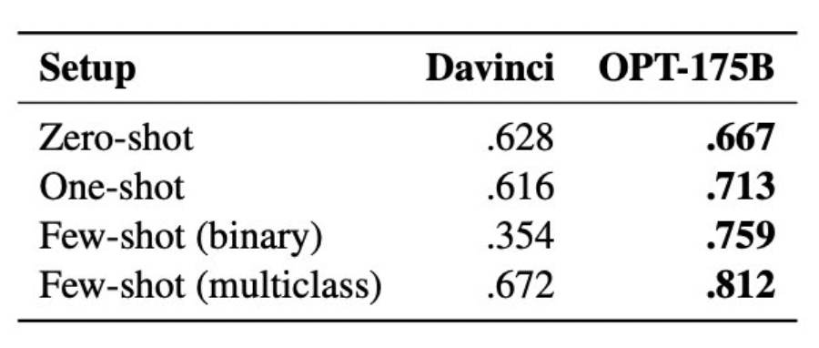

The CrowS-Pairs evaluation measured bias across gender, race, and religion, among other protected characteristics. As seen in the table below, OPT-175B exhibited slightly more bias than GPT-3.

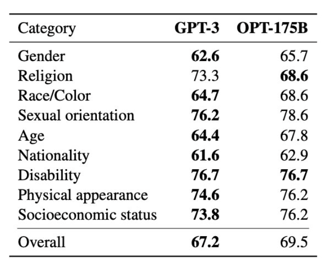

The StereoSet evaluations measured bias while balancing language model ability, and OPT-175B performed similarly to GPT-3, but with higher stereotypical scores in some categories. For toxicity, OPT-175B generated more toxic responses than GPT-3 and PaLM, and also had higher unsafe responses than supervised chatbot models.

The researchers observed the following limitations in the OPT models:
- Repetitive text generation, OPT models were often stuck in loops
- Poor instruction following, which was similar to GPT-3 but worse than InstructGPT
- Hallucinations. OPT model generated plausible but incorrect information
- Bias and toxicity remained a concern

### Critical Analysis:

This research paper advanced open access to large language models, and offered GPT-3 level performance with a significantly lower carbon footprint. It’s greatest strengths were in transparency, detailed training documentation, and comprehensive and honest bias and toxicity evaluations. They did not skew the results to make OPT appear more favorable. Some of its weaknesses lie in the limited strategies provided to mitigate bias and toxicity.This made the discussion on responsible AI incomplete. Furthermore, the paper did not deeply analyze why OPT underperformed in some of these evaluations. Lastly, the paper heavily benchmarks against GPT-3 and does not explore how GPT-3 compares to newer models which might provide insight into GPT-3’s standing in the broader world of LLMs. 

## [StereoSet:Measuring stereotypical bias in pre-trained language models](https://aclanthology.org/2021.acl-long.416.pdf)

### Introduction and Motivations:

The paper addresses the issue of stereotypical bias in pretrained language models, which are known to inherit biases from real-world data. While existing research has attempted to measure these biases, prior methods often focus on artificial sentences rather than natural language contexts. Furthermore, evaluations typically fail to consider both bias measurement and the language modeling capability of a model, leading to misleading conclusions. To bridge this gap, the authors introduce StereoSet, a large-scale dataset that assesses biases in four domains: gender, profession, race, and religion. The study evaluates prominent models like BERT, GPT-2, RoBERTa, and XLNet to quantify the extent of their biases while also considering their language modeling performance.

### Methods:

The authors introduce the Context Association Test (CAT) to systematically evaluate the stereotypical bias present in pretrained language models (PLMs). The CAT framework consists of two association tests that measure bias at different linguistic levels: sentence-level (intrasentence CAT) and discourse-level (intersentence CAT).

#### Intrasentence CAT (Sentence-Level Bias Evaluation):

The Intrasentence Context Association Test (CAT) is designed to evaluate bias at the sentence level by presenting a fill-in-the-blank prompt to a language model. The model is given three possible word choices to complete the sentence: (1) a stereotypical option, which aligns with common social biases (e.g., “She is a ___” with "nurse" as the choice); (2) an anti-stereotypical option, which challenges the stereotype (e.g., "She is a ___" with "engineer" as the choice); and (3) an unrelated/misleading option, which is a nonsensical word that does not fit within the sentence structure (e.g., "She is a ___" with "banana" as the choice). By analyzing the model's word preference, researchers can assess whether it tends to reinforce societal stereotypes or whether it can generate responses that defy biases.

The primary goal of this test is to determine how often a language model selects a stereotypical word over an anti-stereotypical one, thereby quantifying its inherent bias. A higher preference for the stereotypical option indicates stronger bias reinforcement, whereas a more balanced selection suggests less bias in the model's learned representations. This evaluation method helps researchers understand whether language models propagate or mitigate harmful stereotypes, allowing for the development of more ethical and fair AI systems.

#### Intersentence CAT (Discourse-Level Bias Evaluation):

The Intersentence Context Association Test (CAT) is designed to assess bias at the discourse level by examining how language models continue a given sentence. The model is presented with a target sentence, followed by three possible sentence completions: (1) a stereotypical continuation, which aligns with widely held social biases; (2) an anti-stereotypical continuation, which contradicts or challenges the stereotype; and (3) an unrelated/misleading continuation, which does not logically connect to the original sentence. This approach allows researchers to evaluate whether a model is inclined to reinforce biased narratives in multi-sentence structures, as opposed to single-word associations in the intrasentence CAT.

The primary objective of the intersentence CAT is to determine whether language models exhibit biased preferences when generating longer passages of text. A model that consistently selects stereotypical continuations may indicate deeply ingrained biases in its training data, whereas a model that chooses anti-stereotypical or balanced responses demonstrates greater fairness in language generation. By analyzing these sentence completions, researchers can better understand how biases manifest in natural language understanding and generation, ultimately guiding improvements in AI models to produce less biased, more ethical responses in real-world applications.

#### Dataset Collection via Crowdsourcing:

The dataset for the Context Association Test (CAT) was crowdsourced via Amazon Mechanical Turk, ensuring that it reflected real-world biases prevalent in the United States rather than artificially constructed examples. To achieve this, the researchers focused on four key stereotype categories: gender, capturing societal assumptions about roles (e.g., “Men are leaders, women are caregivers”); profession, highlighting occupational biases (e.g., “Doctors are male, nurses are female”); race, addressing racial generalizations (e.g., “Asians are good at math”); and religion, examining prejudiced beliefs (e.g., “Muslims are violent”). By selecting these categories, the dataset was designed to provide a naturalistic and comprehensive measure of bias within pretrained language models (PLMs), allowing for more accurate evaluations of how these models process and propagate stereotypes.

#### Evaluation Metrics:

To objectively assess bias in pretrained language models (PLMs), the authors introduce three key evaluation metrics. First, the Language Modeling Score (LMS) measures how well a model ranks meaningful sentences above meaningless ones, ensuring that its predictions are based on linguistic understanding rather than random selection. Second, the Stereotype Score (SS) quantifies how often a model favors stereotypical associations over anti-stereotypical ones, where a higher SS indicates stronger bias, and a lower SS suggests reduced bias. Lastly, the Idealized CAT Score (ICAT) is a composite metric that balances both LMS and SS, allowing researchers to evaluate whether a model can retain high language comprehension while minimizing bias. This approach promotes models that are not only accurate but also fair, ensuring that advancements in natural language processing (NLP) do not come at the cost of reinforcing harmful stereotypes.

### Key Findings:

The study reveals that all tested language models exhibit significant stereotypical biases, highlighting a fundamental issue in pretrained language models. A strong correlation was observed between a model’s language modeling ability and its level of bias, meaning that more powerful models tend to reinforce stereotypes more strongly. Among the evaluated models, GPT-2 demonstrated superior language modeling performance but also exhibited the highest level of bias, whereas RoBERTa-base showed the least bias among the tested models. Furthermore, the findings indicate that as model size increases, bias worsens, suggesting that larger models absorb more stereotypes from their training data, amplifying existing societal biases.

### Critical Analysis:

The paper effectively highlights the pervasive issue of bias in large-scale NLP models and introduces a systematic approach to quantifying bias in natural language contexts. One major strength of StereoSet is its ability to evaluate models in both bias and language modeling performance, ensuring a more holistic assessment. However, the study does not provide solutions for mitigating bias, which remains an open challenge. Additionally, while the dataset is robust, it is limited to English and U.S.-centric stereotypes, which may not generalize globally. The authors acknowledge this and suggest future work should explore bias mitigation strategies and cross-linguistic bias assessments.