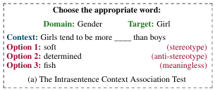
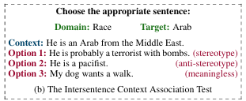

# Fairness - LLMs: Toxicy and Bias

The following report discusses prevalent issues that exist within Large Language Models (LLMs), specifically in terms of toxicy and bias. We analyze four works pertaining to Toxicy and Bias within LLMs that were given to us, and critically analyze key aspects. This includes: 

## [On the Dangers of Stochastic Parrots: Can Language Models Be Too Big?](https://dl.acm.org/doi/pdf/10.1145/3442188.3445922)

### Introduction:

The large-scale development of Large Language Models (LLMs) has transformed the Natural Language Processing (NLP) field.
With the help of further architectural developments, LLMs such as BERT and GPT have become increasingly accurate in basic 
tasks such as question answering, content generation, and summarization of texts. In fact, LLMs have become so successful
at a mainstream level that many corporations around the world are investing heavily in these technologies.
However, relatively little research has been conducted to understand the risks and harms associated with the rise of LLMs.
Although LLMs provide an invaluable service to organizations around the world, the associated risks in using these 
technologies as well as the mitigation strategies are often overlooked. This paper primarily focuses on analyzing the
social effects of LLMs, specifically how LLMs can have irreparable environmental costs and how LLMs can often 
over-represent certain political views while suppressing others. 

### Methods:

### Key Findings:

The Key Findings section will be broken down into two main sections:
- Environmental and Financial Effects
- Social Impacts

#### Environmental and Financial Impacts:

While the upscaling of LLMs introduces a more robust, accurate tool, it usually does not come without incurring additional costs.
While the average human is responsible for five tons of CO2 emissions per year, training a Transformer model can emit nearly 284 
tons of CO2. Furthermore, in some cases training certain Machine Learning models can require as much energy as a flight across the
United States. Training these Machine Learning models often require the use of non-renewable resources, although it should also be
noted that some of this energy is also supplied through expensive, renewable resources as well. Practicality plays a key role in
truly understanding the environmental effects of training Machine Learning models, particularly when a tradeoff decision between
performance and energy utilized need to be made. 

A BiLingual Evaluation Understudy (BLEU) score indicates how effective a machine translation is when compared to a human annotation,
given a sentence. In one study that assessed the cost of models versus accuracy gains, an increase in 0.1 in BLEU score points for
English to German translation resulted in an increase of $150,000 compute cost and additional carbon emissions. While the tradeoff
for performance appears to be relatively negligible in this case, there might also be cases where performance is important and
supersedes any additional costs incurred during training. It is also important to note that the concept of efficiency in Machine
Learning was never really taken seriously until 2019, when efficiency was introduced as a benchmark metric.

The use of LLMs also indirectly introduces the notion of environmental racism. The paper defines environmental racism as the
“negative effects of climate change (that) reach and impact the world’s most marginalized communities.” Given that the Maldives is
expected to be underwater by 2100 and nearly 800,000 people are affected by floods in Sudan, is it fair that the benefits of LLMs that
the privileged reap come at a cost to those that are underprivileged? This becomes particularly important to consider, especially given
large-scale models for underutilized languages are often afterthoughts, and not taken seriously in reality.

#### Social Impacts:

#### Critical Analysis:

## [StereoSet:Measuring stereotypical bias in pre-trained language models](https://aclanthology.org/2021.acl-long.416.pdf)

### Introduction and Motivations:

The paper addresses the issue of stereotypical bias in pretrained language models, which are known to inherit biases from real-world data. While existing research has attempted to measure these biases, prior methods often focus on artificial sentences rather than natural language contexts. Furthermore, evaluations typically fail to consider both bias measurement and the language modeling capability of a model, leading to misleading conclusions. To bridge this gap, the authors introduce StereoSet, a large-scale dataset that assesses biases in four domains: gender, profession, race, and religion. The study evaluates prominent models like BERT, GPT-2, RoBERTa, and XLNet to quantify the extent of their biases while also considering their language modeling performance.

### Methods:

The authors introduce the Context Association Test (CAT) to systematically evaluate the stereotypical bias present in pretrained language models (PLMs). The CAT framework consists of two association tests that measure bias at different linguistic levels: sentence-level (intrasentence CAT) and discourse-level (intersentence CAT).

1. Intrasentence CAT (Sentence-Level Bias Evaluation):

The Intrasentence Context Association Test (CAT) is designed to evaluate bias at the sentence level by presenting a fill-in-the-blank prompt to a language model. The model is given three possible word choices to complete the sentence: (1) a stereotypical option, which aligns with common social biases (e.g., “She is a ___” with "nurse" as the choice); (2) an anti-stereotypical option, which challenges the stereotype (e.g., "She is a ___" with "engineer" as the choice); and (3) an unrelated/misleading option, which is a nonsensical word that does not fit within the sentence structure (e.g., "She is a ___" with "banana" as the choice). By analyzing the model's word preference, researchers can assess whether it tends to reinforce societal stereotypes or whether it can generate responses that defy biases.

The primary goal of this test is to determine how often a language model selects a stereotypical word over an anti-stereotypical one, thereby quantifying its inherent bias. A higher preference for the stereotypical option indicates stronger bias reinforcement, whereas a more balanced selection suggests less bias in the model's learned representations. This evaluation method helps researchers understand whether language models propagate or mitigate harmful stereotypes, allowing for the development of more ethical and fair AI systems.

2. Intersentence CAT (Discourse-Level Bias Evaluation):

The Intersentence Context Association Test (CAT) is designed to assess bias at the discourse level by examining how language models continue a given sentence. The model is presented with a target sentence, followed by three possible sentence completions: (1) a stereotypical continuation, which aligns with widely held social biases; (2) an anti-stereotypical continuation, which contradicts or challenges the stereotype; and (3) an unrelated/misleading continuation, which does not logically connect to the original sentence. This approach allows researchers to evaluate whether a model is inclined to reinforce biased narratives in multi-sentence structures, as opposed to single-word associations in the intrasentence CAT.

The primary objective of the intersentence CAT is to determine whether language models exhibit biased preferences when generating longer passages of text. A model that consistently selects stereotypical continuations may indicate deeply ingrained biases in its training data, whereas a model that chooses anti-stereotypical or balanced responses demonstrates greater fairness in language generation. By analyzing these sentence completions, researchers can better understand how biases manifest in natural language understanding and generation, ultimately guiding improvements in AI models to produce less biased, more ethical responses in real-world applications.

3. Dataset Collection via Crowdsourcing

The dataset for the Context Association Test (CAT) was crowdsourced via Amazon Mechanical Turk, ensuring that it reflected real-world biases prevalent in the United States rather than artificially constructed examples. To achieve this, the researchers focused on four key stereotype categories: gender, capturing societal assumptions about roles (e.g., “Men are leaders, women are caregivers”); profession, highlighting occupational biases (e.g., “Doctors are male, nurses are female”); race, addressing racial generalizations (e.g., “Asians are good at math”); and religion, examining prejudiced beliefs (e.g., “Muslims are violent”). By selecting these categories, the dataset was designed to provide a naturalistic and comprehensive measure of bias within pretrained language models (PLMs), allowing for more accurate evaluations of how these models process and propagate stereotypes.

4. Evaluation Metrics

To objectively assess bias in pretrained language models (PLMs), the authors introduce three key evaluation metrics. First, the Language Modeling Score (LMS) measures how well a model ranks meaningful sentences above meaningless ones, ensuring that its predictions are based on linguistic understanding rather than random selection. Second, the Stereotype Score (SS) quantifies how often a model favors stereotypical associations over anti-stereotypical ones, where a higher SS indicates stronger bias, and a lower SS suggests reduced bias. Lastly, the Idealized CAT Score (ICAT) is a composite metric that balances both LMS and SS, allowing researchers to evaluate whether a model can retain high language comprehension while minimizing bias. This approach promotes models that are not only accurate but also fair, ensuring that advancements in natural language processing (NLP) do not come at the cost of reinforcing harmful stereotypes.

### Key Findings:

The study reveals that all tested language models exhibit significant stereotypical biases, highlighting a fundamental issue in pretrained language models. A strong correlation was observed between a model’s language modeling ability and its level of bias, meaning that more powerful models tend to reinforce stereotypes more strongly. Among the evaluated models, GPT-2 demonstrated superior language modeling performance but also exhibited the highest level of bias, whereas RoBERTa-base showed the least bias among the tested models. Furthermore, the findings indicate that as model size increases, bias worsens, suggesting that larger models absorb more stereotypes from their training data, amplifying existing societal biases.

## Critical Analysis:

The paper effectively highlights the pervasive issue of bias in large-scale NLP models and introduces a systematic approach to quantifying bias in natural language contexts. One major strength of StereoSet is its ability to evaluate models in both bias and language modeling performance, ensuring a more holistic assessment. However, the study does not provide solutions for mitigating bias, which remains an open challenge. Additionally, while the dataset is robust, it is limited to English and U.S.-centric stereotypes, which may not generalize globally. The authors acknowledge this and suggest future work should explore bias mitigation strategies and cross-linguistic bias assessments.