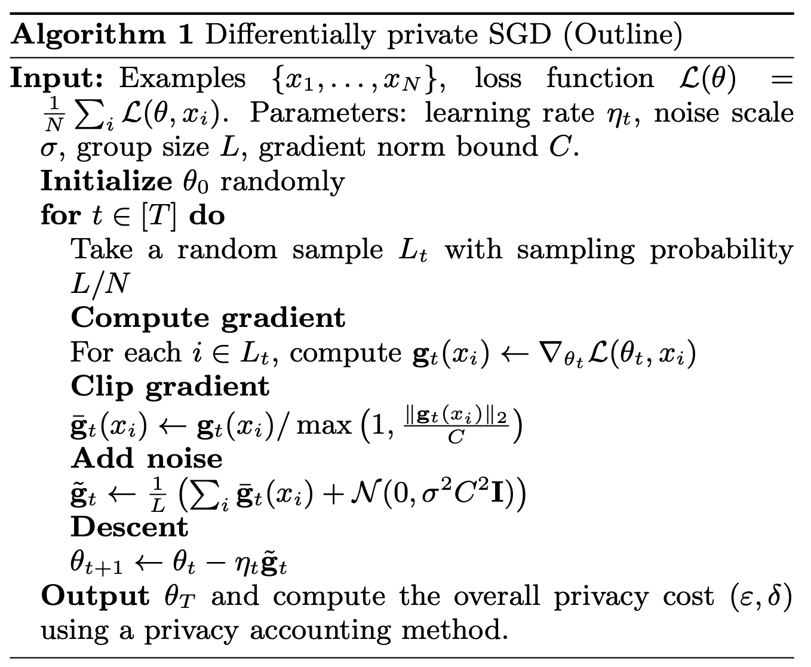
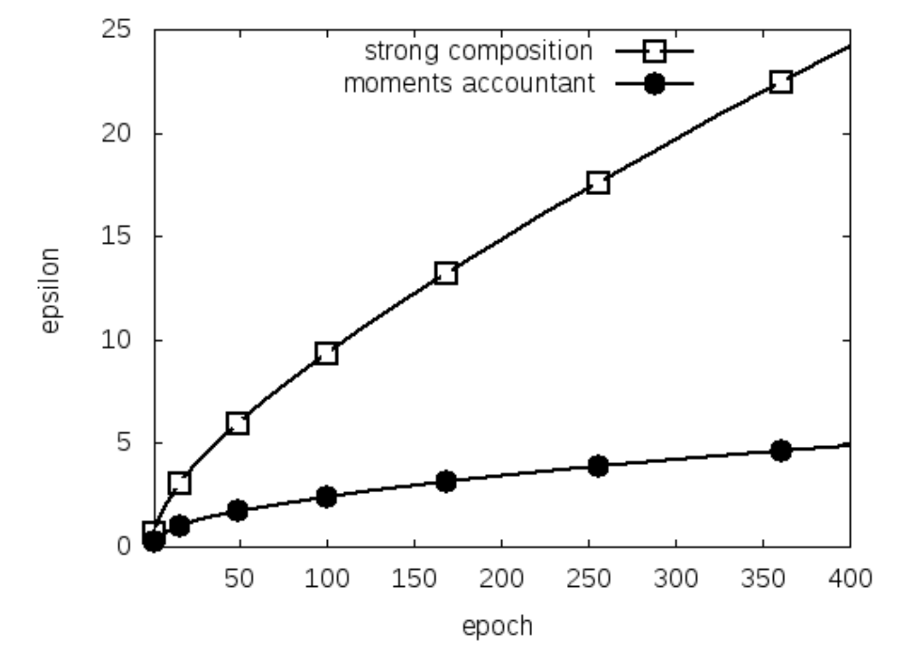
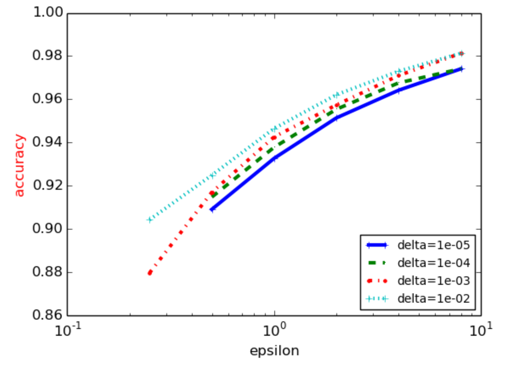
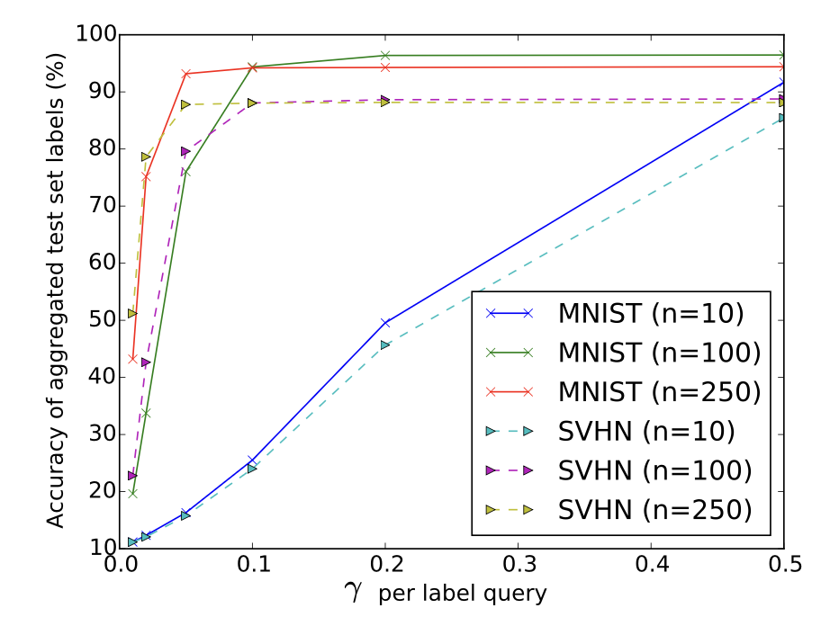
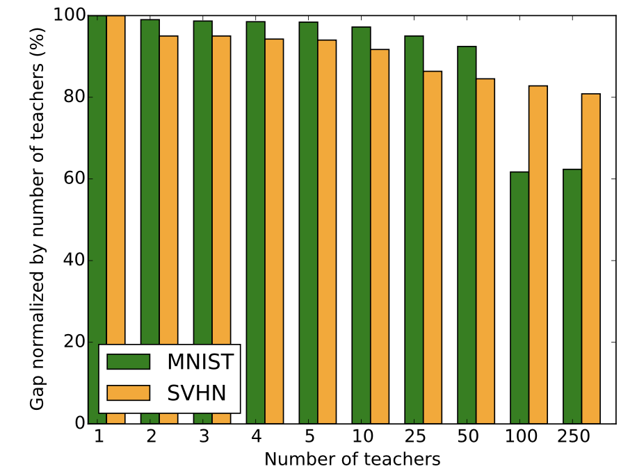

# [Differentially Private Empirical Risk Minimization](https://www.jmlr.org/papers/volume12/chaudhuri11a/chaudhuri11a.pdf). Chaudhuri et al 2011. 


## Introduction 

Anonymization and data aggregation are not enough for data privacy, as datasets can be cross-referenced or reverse-engineered to reveal sensitive personal information on the training data. Instead, researchers have developed ε-differential privacy methods, which mathematically guarantees the following definition of privacy: changing a single data point does not shift the output distribution “by too much” (some given epsilon degree). This makes it difficult to infer the value of any particular data point that a model was trained on, ensuring user data is kept safe. This particular paper dives into the empirical risk minimization (ERM) framework, introducing two methods of differential privacy on classification tasks. ERM’s goal is to minimize the average over the training data of the prediction loss (with respect to the label) of the classifier in predicting each training data point. The two methods, output perturbation and objective perturbation, follow this framework by introducing noise in two different parts of the ERM pipeline—the output of the standard ERM algorithm and regularized ERM objective function prior to minimizing loss, respectively. The researchers also follow end-to-end privacy, ensuring that each step in the model learning process remains private, since intermediate steps such as training and parameter tuning can cause additional risks of privacy violations. 

## Methods 

## Key Findings 

## Critical Analysis 

### Strengths 

Objective perturbation is the most important contribution. Instead of adding noise after training, it adds noise directly to the objective function before training starts. This means the method needs less noise overall. The result is a model that still performs well but keeps data private. This helps balance privacy and accuracy, which is often a hard problem in privacy-preserving machine learning. The paper proves that both methods give ε-differential privacy guarantees. It also gives bounds on generalization error, showing that the model trained with noise will still do well on unseen data. These theoretical results are solid and make the work trustworthy.

The authors show that their methods can be used with logistic regression, support vector machines, and kernel methods. These are common models, so the paper is useful to many real-world applications. They also talk about how to protect privacy during hyperparameter tuning, which is an important but often overlooked part of the learning process. 

### Weaknesses 

The methods only work when the loss function and the regularizer are both smooth and strongly convex. This means the approach cannot be used with L1 regularization or with hinge loss. These are common in many real models. So, the method may not work well in practice for all tasks. The way the paper applies privacy to kernel methods is not very efficient. It may lose some performance or require extra steps like using random feature mappings. This could make the model slower or harder to train. The experiments are limited. The datasets are not very large or complex. The paper does not test on modern deep learning models. So, it is hard to say how well the method works in more advanced settings.

### Potential biases 

If the training data contains imbalance, the model might learn patterns that do not generalize well to those groups. Differential privacy adds noise, which may hurt performance more on small subgroups. This can lead to unequal accuracy across different users.

The model is optimized to reduce average loss. But average accuracy does not always reflect fairness. The noise added for privacy may hide these fairness issues. This is important in applications like healthcare or education, where different groups may be affected differently.

### Ethical considerations 

# [Deep Learning with Differential Privacy](https://arxiv.org/abs/1607.00133). Abadi et al, 2016 

## Introduction

This paper addresses the need for privacy-preserving ML techniques, particularly for deep neural networks trained on sensitive, potentially crowdsourced datasets. It is critical to balance machine learning training objectives with privacy-preserving goals. In this paper, the authors improve the efficiency of differentially private training in Tensorflow, demonstrating that by tracking detailed information of privacy loss, the overall privacy loss can be estimated accurately.

## Methods

This paper introduces a method based on differentially private Stochastic Gradient Descent (DP-SGD). Algorithm 1 (shown in the figure below) outlines this method.



The key parts are:
Control the influence of the training data on the weights of a neural network by clipping gradient norms at different thresholds across layers of the network
In typical differential privacy fashion, add noise to the data to improve anonymity. Specifically, add gaussian noise to the gradients before back propagation.

The authors also introduce a “moments accountant” which is used to control training and continuously estimate the privacy loss. They propose this as an improvement (a tighter upper bound) to an expected privacy loss calculated by the “strong composition theorem”, which they provide as: 

**Theorem**: *There exist constants* $c_1$ *and* $c_2$ *so that given the sampling probability* $q = L/N$ *and the number of steps* $T$, *for any* $\varepsilon < c_1 q^2 T$, *Algorithm 1 is* $(\varepsilon, \delta)$-*differentially private for any* $\delta > 0$ *if we choose*

```math
\sigma \geq c_2 \frac{q \sqrt{T \log(1/\delta)}}{\varepsilon}.
```

The moments accountant uses the following privacy loss ($`c`$)
```math
c(o; \mathcal{M}, \text{aux}, d, d') \triangleq \log \frac{\Pr[\mathcal{M}(\text{aux}, d) = o]}{\Pr[\mathcal{M}(\text{aux}, d') = o]}.
```
where $`o`$: outcome, $`\mathcal{M}`$: mechanism, $`\text{aux}`$: auxiliary input, $`(d, d')`$: neighboring datasets

The accountant continuously updates the state of training with this privacy loss estimate. They use a privacy budget to balance training with two variables
- Epsilon ($`\varepsilon`$): measure of privacy loss. Higher epsilon means stronger privacy but weaker statistical accuracy
- Delta ($`\delta`$): probability of a privacy breach, secondary parameter that works with epsilon to balance privacy and utility

**Hyperparameter tuning**: The authors hypothesize that using their differential privacy mechanism, the range of values for hyperparameters would decrease and less tuning would be necessary. They propose that the learning rate, for example, would not need to decay like it would in traditional ML training. This is probably because the noise added by the privacy mechanism would hinder convergence at a lower learning rate, when the model would be trying to make smaller adjustments to the training data. The researchers evaluate their DP-SGD algorithm on the MNIST and CIFAR-10 image classification tasks. They also add a layer of PCA projection to improve dimensionality reduction.

## Key Findings

Researchers achieve 97% training accuracy on MNIST and 73% training accuracy on CIFAR-10 with $`\varepsilon = 8`$, $`\delta=10^{-5}`$ differential privacy. When compared to the expected privacy loss returned by their strong composition theorem, researchers find the moments accountant provides a tighter bound on epsilon.


*Figure: The $`\varepsilon`$ value as a function of epoch $`E`$ for $`q= 0.01, σ= 4, δ= 10^{−5}`$, using the strong composition theorem and the moments accountant respectively.*

Generally, training accuracy increases as epsilon and delta constraints are relaxed, with higher values of delta steepening the accuracy vs. epsilon tradeoff as observed in the figure below.


*Figure: Accuracy of various $`(\varepsilon, \delta)`$ privacy values on the MNIST dataset. Each curve corresponds to a different $`\delta`$ value.*


## Critical Analysis

### Strengths

Researchers reach a good balance between privacy and accuracy on basic image classification tasks. They also provide a robust Tensorflow model design that can address both objectives. The models’ ability to converge with additional non-convex, privacy-focused objectives is also impressive. 

### Weaknesses

The results section could include more experiments comparing with non-privacy preserving approaches to illustrate the performance difference between the differentially private model and baseline model. Also, the task itself is rudimentary, and more sophisticated benchmarks could illustrate a more impactful usage of the DP-SGD algorithm, such as those in the natural language processing or generative domain. The researchers should also report more robust metrics such as F1 to improve the validity of their results.

### Potential biases

The evaluation is conducted on image classification datasets, and the performance and privacy-accuracy trade-off might differ for other types of data and ML tasks such as NLP. The approach is also focused on SGD, and other algorithms might yield different results.

### Ethical considerations

While the paper shows how ML methods can be modified to satisfy differential privacy guarantees, these might lead to a false sense of privacy and mislead the user. Moreover, added noise may affect underrepresented groups or degrade model utility in sensitive applications, leading to unequal or even harmful outcomes.

# [Semi-supervised Knowledge Transfer for Deep Learning from Private Training Data](https://arxiv.org/abs/1610.05755). Papernot et al, 2016 

## Introduction

Similar to the earlier two papers, this work also addresses the critical problem of protecting the privacy of sensitive training data in ML. The authors note that ML models can inadvertently store training data, potentially revealing sensitive information through model analysis. While the prior works were restricted in their model choices, this paper presents a model agnostic approach that can be applied to any machine learning model.

They present PATE - Private Aggregation of Teacher Ensembles, designed to provide strong privacy guarantees for training data. The key idea is to train multiple teacher models on disjoint datasets, and then use their aggregated, noisy predictions to train a public student model that queries the teacher models to learn the class labels.

## Methods


*Figure: Overview of the approach: (1) an ensemble of teachers is trained on disjoint subsets of the sensitive data, (2) a student model is trained on public data labeled using the ensemble. * 

PATE method involves the following key steps:

### Ensemble of Teachers
The sensitive training data is partitioned into disjoint subsets, and each subset is used to train an independent teacher model. Given the nature of the approach, these can utilize any ML model for training. 

### Noisy Aggregation
Given an input query $`\vec{x}`$, each teacher would make a prediction. To protect the privacy of the sensitive data, these predictions are then aggregated using a noisy voting mechanism, as shown below. 

```math
f(x) = \arg\max_j \left\{ n_j(\vec{x}) + \text{Lap}\left(\frac{1}{\gamma}\right) \right\}
```
If $`n_j`$ is the count of teachers voting for label $`j`$, the reported label would include an added Laplacian noise with $`\gamma`$ the noise controlling parameter. Intuitively, larger $`\gamma`$ leads to a strong privacy guarantee, but can degrade the accuracy of the labels.

Given the addition of noise, the model would become useless after a bounded number of queries. This makes it impractical to make it public facing since the number of user queries can’t be limited. Therefore, the teacher ensemble is kept private, and is only exposed to a “student”.

### Student Model

A separate “student” model is trained to mimic the predictions of the noisy aggregate teacher ensemble. The student trains on non-sensitive, potentially unlabelled data that is publicly available, and queries the teacher models for a quorum on the label for each input. Since the student only makes limited queries to the teacher (only during training), the privacy costs can be kept limited. The end-user queries will not have an impact on the overall privacy costs. To further minimize the number of queries to the teacher models, the authors propose the use of semi-supervised, generative models called PATE-G.

### Moments Accountant

Another key aspect of this work is the use of the moments accountant (as proposed by Abadi et al.) to rigorously track the privacy cost throughout the student’s training. The authors present a data-dependent privacy analysis which takes advantage of the fact that when the quorum among the teachers is very strong, the majority outcome has overwhelming likelihood, which means that the privacy cost is small whenever that outcome occurs. The moments accountant allows for analysis of the composition of such mechanisms.

## Key Findings

The paper shows that the PATE approach achieves SOTA privacy on the MNIST and SVHN image classification datasets. The authors report that the classifiers achieve an $`(\varepsilon, \delta)`$ differential-privacy bound of $`(2.04, 10^{-5})`$ for MNIST and $`(8.19, 10^{-6})`$ for SVHN respectively, with accuracy of 98% and 90.66%.  This is an improvement over prior results. 


*Figure: **Utility and privacy of the semi-supervised students:** each row is a variant of the student model trained with generative adversarial networks in a semi-supervised way, with a different number of label queries made to the teachers through the noisy aggregation mechanism. The last column reports the accuracy of the student and the second and third column the bound $`\varepsilon`$ and failure probability $`\delta`$ of the $`(\varepsilon, \delta)`$ differential privacy guarantee.*

The data dependent privacy analysis used in the paper provides tighter privacy bounds when the agreement (quorum) among teachers is strong. The authors also demonstrate the applicability of PATE on other datasets (like the UCI adult & diabetes data) and models (random forests).

The authors also report the effect of the amount of noise that can be injected into a query on the accuracy. This is considered for a teacher ensemble count of $`n = \{10, 100, 250\}`$.


*Figure: **How much noise can be injected to a query?** Accuracy of the noisy aggregation for three MNIST and SVHN teacher ensembles and varying $`\gamma`$ value per query. The noise introduced to achieve a given $`\gamma`$ scales inversely proportionally to the value of $`\gamma`$: small values of $`\gamma`$ on the left of the axis correspond to large noise amplitudes and large $`\gamma`$ values on the right to small noise.*

Since the model is quorum dependent, a larger gap between the most and the second-most voted class labels indicate that the ensemble is confident in assigning the labels, and so will be robust to more noise injection.


*Figure: **How certain is the aggregation of teacher predictions?** Gap between the number of votes assigned to the most and second most frequent labels normalized by the number of teachers in an ensemble. Gaps were computed by averaging over the test data.*


## Critical Analysis

### Strengths
- Since PATE is a black-box approach, the method is generally applicable, and is independent of the specific ML algorithm used for training the teachers or the student.​​
- Use of the moments accountant (from Abadi et al.) allows PAtE to have a more refined and tighter analysis of the privacy cost
- PATE is formally grounded in differential privacy, and the analysis by the authors makes it intuitive.
- Combining PATE with a semi-supervised generative learning (PATE-G) leverages unlabelled public data to improve student’s efficiency without many queries, thereby controlling the overall privacy costs.
### Weaknesses
- Primary requirement for PATE is the availability of disjoint data for training, which might not be possible in all cases.
- Since the student models are public, PATE relies on non-sensitive , potentially unlabelled data to train the student models. Such a dataset might not be always available.
- PATE relies on teacher quorum (level of agreement among the teachers). If the predictions are highly variable, the noisy aggregation might lead to a less informative signal for students.
- Larger number of teachers might mean better privacy guarantees, but might often come at the loss of training accuracy.
### Potential biases
- The model relies on partitioned data, and the way this is done can introduce biases if the partitions aren’t representative of the overall data distribution.
- Noisy aggregation of teacher predictions might introduce bias in the target signal that the student learns from


### Ethical considerations

Given the goal of the paper to protect the privacy of sensitive training data, extremely rare scenarios that the teacher models haven’t seen might cause unreliable student predictions, raising ethical concerns. Additionally, while the PATE model itself is transparent, lack of knowledge of the training data could lead to issues when trying to interpret model outcomes. However, this remains a valid trade-off given privacy concerns.